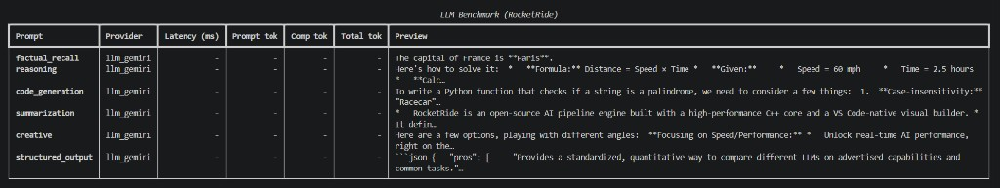

# LLM Benchmark Pipeline (RocketRide)

Benchmark multiple LLM providers on the same prompt set using a RocketRide `.pipe` pipeline + Python SDK runner.

## Why

Choosing an LLM provider for production based on vendor benchmarks is guesswork. Latency and token usage can vary significantly for *your* prompts, *your* models, and *your* regions. This project makes it easy to run a repeatable, apples-to-apples comparison across providers.

## Architecture

The core pipeline is defined in `.pipe/benchmark.pipe` and executed by the RocketRide engine:

- **Source**: `dropper` (local, file-based input)
- **Parse**: `parse` (extract text from uploaded `.txt`)
- **Question**: `question` (convert text → `questions` lane)
- **Fan-out**: `llm_gemini` (Gemini Flash) for a local, no-paid-credits run
- **Aggregate/Return**: single `response_answers` node that merges all provider outputs into one result

## Screenshot

Add a real run screenshot here:



## Setup

### 1) Start RocketRide engine (Docker)

```bash
docker pull ghcr.io/rocketride-org/rocketride-engine:latest
docker create --name rocketride-engine -p 5565:5565 ghcr.io/rocketride-org/rocketride-engine:latest
docker start rocketride-engine
```

### 2) Python dependencies

```bash
python -m venv .venv
# Windows (PowerShell)
.venv\Scripts\Activate.ps1

pip install -r requirements.txt
```

### 3) Configure environment

Copy `.env.example` to `.env` and fill in:

- `ROCKETRIDE_URI` (default: `ws://localhost:5565`)
- `ROCKETRIDE_GEMINI_KEY`

Do **not** commit `.env`.

### 4) Run benchmark

```bash
python src/run_benchmark.py
```

The script:

- reads prompts from `src/prompts.json`
- uploads one prompt at a time as a `.txt` file into the `dropper` source
- prints a comparison table (provider, latency/tokens when available)
- writes raw results to `results/benchmark_results.json`

## Example output

Your output will look like:

| Prompt | Provider | Latency (ms) | Prompt tok | Comp tok | Total tok |
| --- | --- | ---:| ---:| ---:| ---:|
| reasoning | llm_gemini | 410 | 33 | 22 | 55 |

## How it uses RocketRide

- **Pipeline definition**: `.pipe/benchmark.pipe` (portable JSON format)
- **Execution**: `rocketride` Python SDK (`RocketRideClient.use()` + `send_files()`)
- **Observability**: runner enables trace capture (`pipelineTraceLevel="full"`) and extracts token/latency when present

## Author

Built by Anant Teotia as part of the RocketRide AI Developer Intern application.

